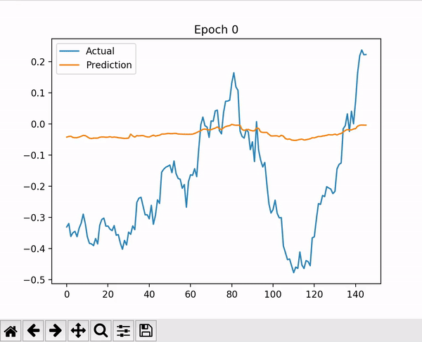
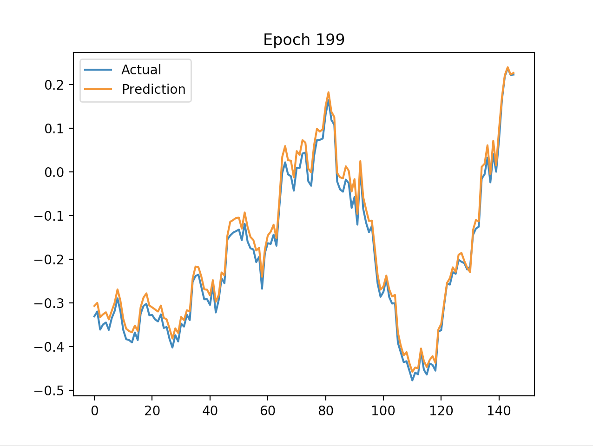
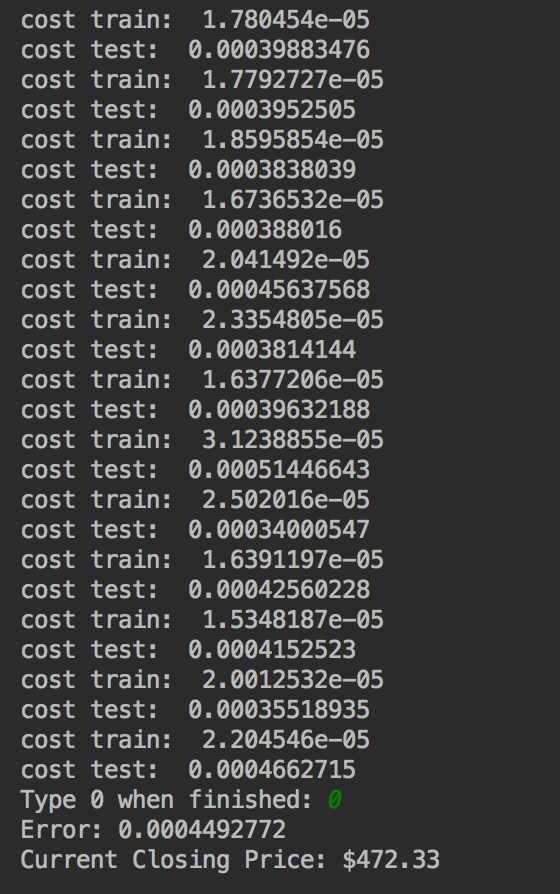

# Cryptocurrency Modeler using AI
Made using Tensorflow and Python, this AI program models cryptocurrency prices and visually depicts them on a constantly updating graph

Run: 
/nMore runtime: 
/nCost during training and testing runs: 
